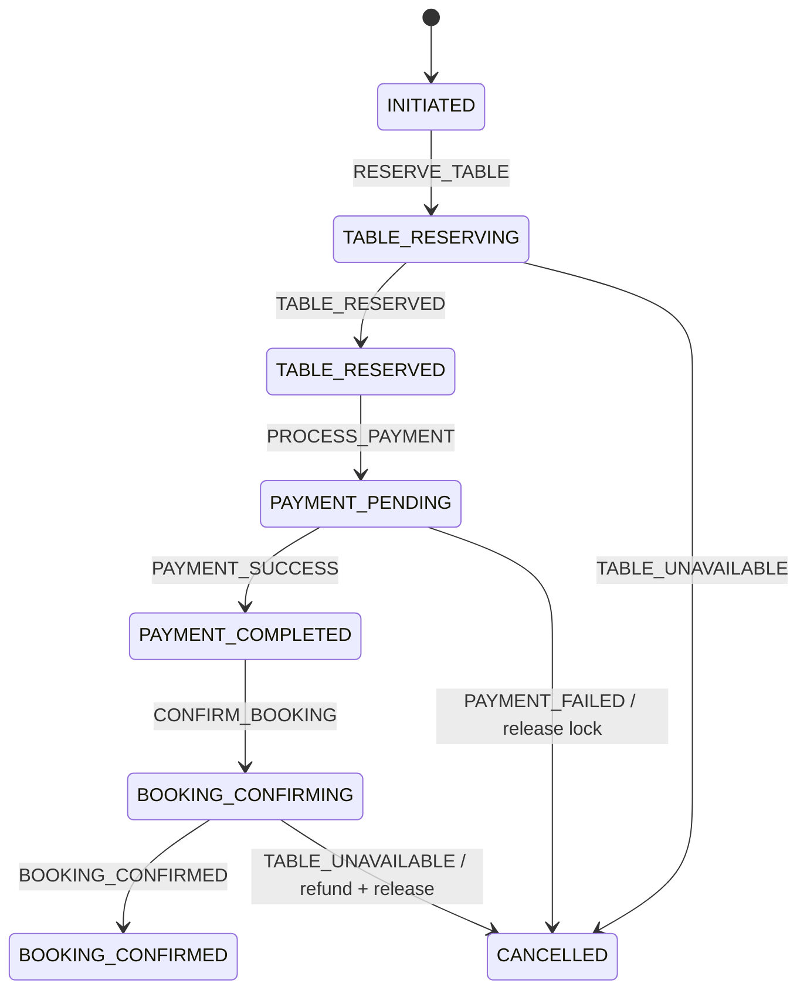

# SS15_HW05 - Giao dịch bù và Semantic Lock

**Sinh viên:** Trương Hà Cẩm Linh - **Mã sinh viên:** PTIT056

## 1. Mở rộng từ bài State Machine

Bài 4 chỉ điều phối thanh toán và giữ chỗ. Bài này thêm trạng thái trung gian `RESERVED` cho bàn và thêm dấu vết `paymentId` vào Saga. Dấu vết đó cho phép State Machine biết giao dịch nào đã hoàn tất để gọi bù trừ, ngay cả khi trạng thái hiện tại đã chuyển sang `CANCELLED`.

Ba module độc lập:

- `orchestrator-service` (8080): quản lý State Machine và thứ tự bù trừ.
- `payment-service` (8081): tạo bản ghi `PAYMENT` và `REFUND`, cung cấp Audit Trail.
- `table-service` (8082): giữ, xác nhận, giải phóng bàn và tự động hết hạn Semantic Lock.

## 2. Tại sao cần Semantic Lock?

Nếu chuyển thẳng `AVAILABLE -> BOOKED`, hệ thống không biểu diễn được khoảng thời gian khách đang thanh toán. Người khác vẫn nhìn thấy bàn trống và cùng đặt, gây tranh chấp. Trạng thái `RESERVED` là khóa ngữ nghĩa: dữ liệu vẫn đọc được nhưng UI hiểu rằng bàn đang tạm giữ và hiển thị **“Bàn đang được giữ”**.

Lock lưu `reservedBy` và `reservedAt`. Chỉ booking sở hữu lock mới được xác nhận hoặc giải phóng. Scheduled task quét định kỳ và trả bàn về `AVAILABLE` nếu lock quá 5 phút, tránh bàn bị giữ vĩnh viễn khi Saga chết giữa chừng.

## 3. Tại sao REFUND không xóa PAYMENT?

Xóa PAYMENT làm mất bằng chứng rằng tiền từng được thu. Payment Service giữ nguyên bản ghi debit `PAYMENT` và thêm một bản ghi credit `REFUND` có số tiền đối ứng. Kế toán có thể kiểm tra ai thu, ai hoàn và thời điểm phát sinh; tổng hai bản ghi bằng 0 nhưng lịch sử không bị sửa.

Refund có tính idempotent theo `bookingId`: gọi bù trừ lặp lại chỉ trả bản ghi REFUND đã có, không cộng tiền hai lần.

## 4. State Machine



Luồng lỗi `FAILED_ALREADY_TAKEN`:

1. B7 chuyển `AVAILABLE -> RESERVED`.
2. Payment tạo bản ghi PAYMENT `-500000`.
3. Xác nhận cuối thất bại vì bàn đã bị chiếm.
4. Saga chuyển `CANCELLED`.
5. Payment tạo REFUND `+500000`, không xóa PAYMENT.
6. Table Service trả B7 về `AVAILABLE`.

## 5. Chạy dự án

Yêu cầu Java 17. Mở ba terminal:

```bash
./gradlew :payment-service:bootRun
./gradlew :table-service:bootRun
./gradlew :orchestrator-service:bootRun
```

Sau đó chạy:

```bash
chmod +x demo/run-scenarios.sh
./demo/run-scenarios.sh
```

Script in ba kết quả: booking `CANCELLED`, Audit Trail có cả `PAYMENT` và `REFUND`, bàn B7 trở lại `AVAILABLE`.

## 6. API kiểm tra

```text
POST http://localhost:8080/api/table-bookings
GET  http://localhost:8080/api/table-bookings/{bookingId}
GET  http://localhost:8081/api/payments/audit/{bookingId}
GET  http://localhost:8082/api/tables/{tableNumber}
```

Khi bàn đang `RESERVED`, API cuối trả trường `message: "Bàn đang được giữ"` để UI hiển thị đúng trạng thái.

## 7. Lưu ý production

Demo lưu dữ liệu trong RAM. Hệ thống thật cần database và cập nhật lock bằng optimistic/pessimistic locking hoặc câu lệnh atomic, lưu Saga bền vững, transactional outbox, retry queue cho refund, phân quyền API release và đồng bộ thời gian giữa các máy chủ.
